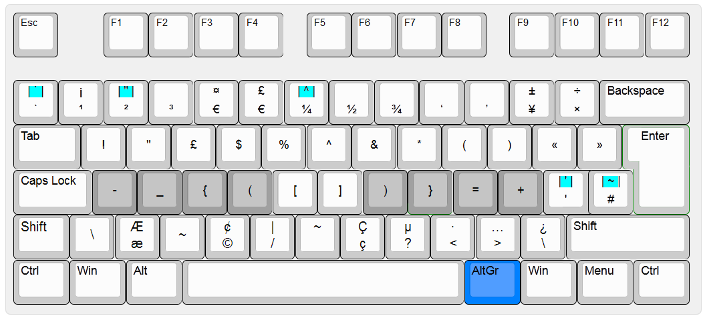
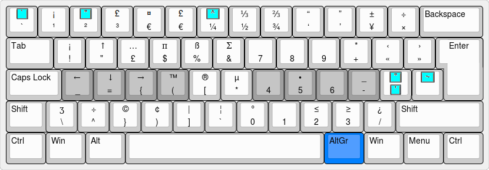
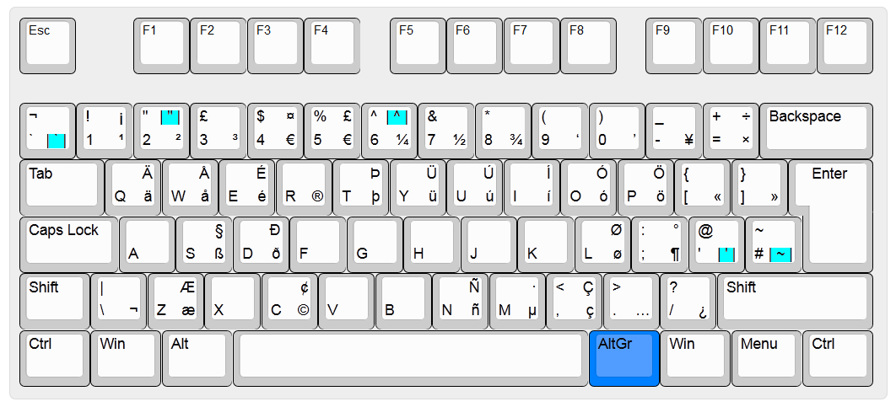
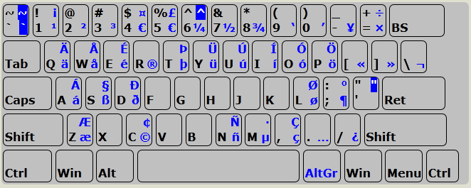

AltGr AutoHotkey scripts
=========================

## AltGr Progammer extension

Makes available commonly needed programmer characters such as brackets and symbols, available in convenient locations on the keyboard. Avoid awkward stretching for those common keys. Also adds a virtual numeric keybad to right hand. 

- Hold AltGr then press another key to get the desired character.  AltGr is an ideal key as it can be hit with the right thumb.
- Many common characters used by programmers such as brackets are on the home row or other easy to reach keys.
- Numeric keypad allows quick entering of numbers without leaving the home position.
- Also implements some of the AltGr International Extension (see below) so you can also type many extended and accented characters via dead keys (indicated with light blue background).

Variations are available for layouts that implement the [Angle-Mod](http://colemakmods.github.io/ergonomic-mods/angle.html) and [Wide-Mod](http://colemakmods.github.io/ergonomic-mods/wide.html), examples are shown below. Note, for users of alternative layouts, these AHK files can be optionally used in conjuction with [AHK keymap scripts](../keymap/) or with [KLC layouts](../KLC/).

AltGr mappings, UK keyboard shown. Should work fine on US and other layouts too.

AltGr mappings with the Angle-Mod enabled.

AltGr mappings with both Angle and Wide Mods enabled.

## AltGr International extension 

Makes a variety of accented characters, currency, mathematical and other symbols all available via the AltGr key.

It is largely based on the US International keyboard layout, which allows a wide variety of characters to be typed but has some shortcomings: (i) the apostrophe key is redefined and becomes a dead key and (ii) it is only available for US layouts.

Using this script, all standard key presses remain unchanged, and is intended to work on both US and UK keyboards. All the additional characters can be typed with the help of the AltGr key. There are also some dead-key combinations which can be used to type an even wider variety of additional characters, again using the AltGr key.

The key mappings defined by the script are shown on the right-hand side of the key. Dead keys are indicated with a light blue background.

AltGr International extension on a UK keyboard

AltGr International extension on a US keyboard

Examples:

© : AltGr + c

á : AltGr + a

½ : AltGr + 7

Ñ : AltGr + ~ then N

â : AltGr + ^ then a

Ü : AltGr + " then U

