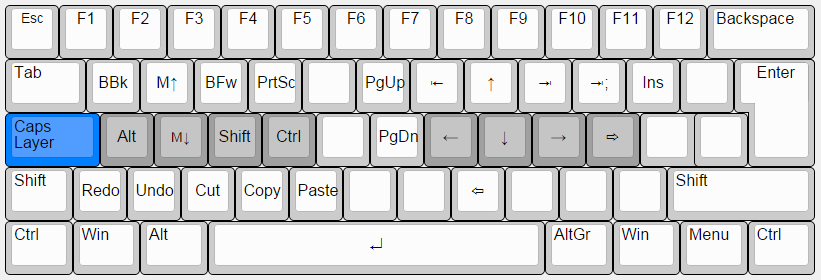
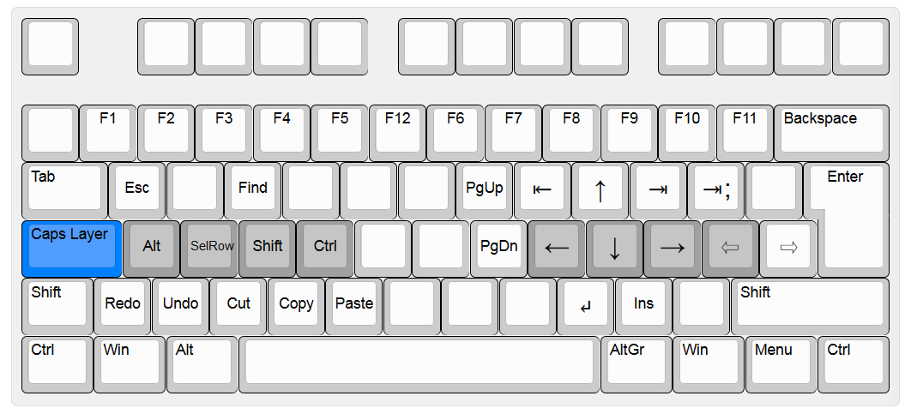

CapsLock Extend Layer AutoHotkey scripts
========================================

This script provides a new layer via the CapsLock key, similar to and inspired by [DreymaR's Extend Layer](http://forum.colemak.com/viewtopic.php?id=1438). This implementation is entirely in AutoHotkey.

- Provides navigation features such as arrow keys, home, end, page up/down, backspace/delete without the need to move your hands away from the home position.
- Also defines accessible additional shift and control within the layer to allow easy selection and editing of text.
- Detects keyboard scancodes so as to work with any keyboard layout (let me know if this is not the case!). Tested with Qwerty and Colemak.

There is also a Wide version suitable for use with the [KLC Wide Layouts](../KLC/):

