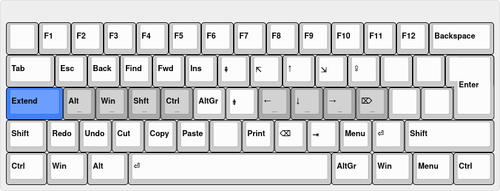
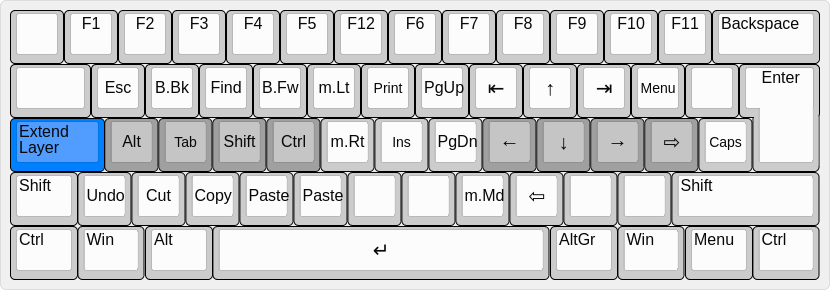
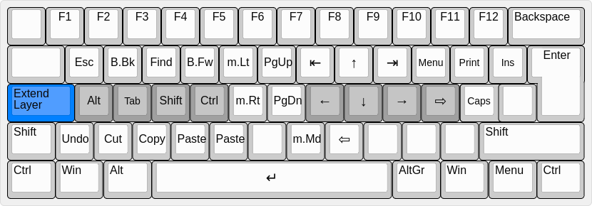
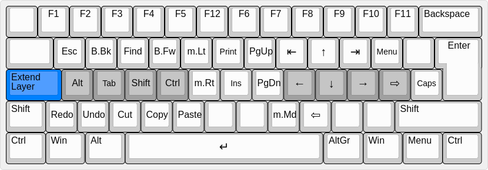

Extend Layer AutoHotkey scripts
===============================

This script provides a new navigation and editing layer on a chosen modifier key, similar to and inspired by [DreymaR's Extend Layer](http://forum.colemak.com/viewtopic.php?id=1438). This implementation is entirely in AutoHotkey.

The key to act as the modifier is configurable. DreymaR's version uses CapsLock, but I have found LeftAlt is also an excellent choice. To configure, remap the chosen key to the virtual key "F22" and the new layer will become available on that key.

- Provides navigation features such as arrow keys, home, end, page up/down, backspace/delete without the need to move your hands away from the home position.
- Also defines accessible additional shift and control within the layer to allow easy selection and editing of text.
- Detects keyboard scancodes so as to work with any keyboard layout (let me know if this is not the case!). Tested with Qwerty and Colemak.

**[Download](extend_layer_std.ahk) a configuration for Colemak or Qwerty standard layouts:**

**[Download](extend_layer_wide.ahk) a configuration for the Colemak/Qwerty [Wide Layouts](../KLC/):**

**[Download](extend_layer_dh.ahk) a configuration for the [Colemak Mod-DH](http://colemakmods.github.io/mod-dh/) layout:**

**[Download](extend_layer_wide_dh.ahk) a configuration for the [Colemak Mod-DH](http://colemakmods.github.io/mod-dh/) Wide layout:**

